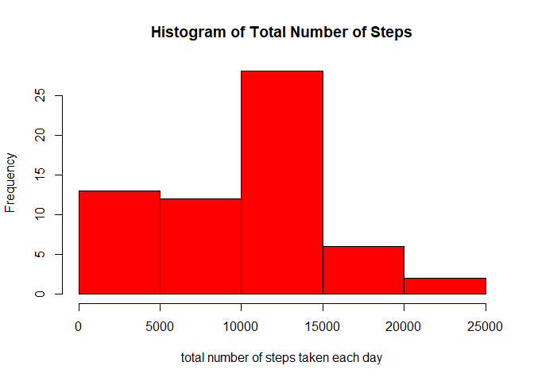
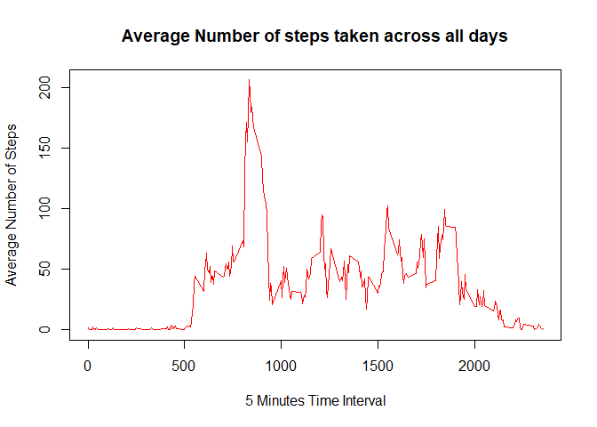
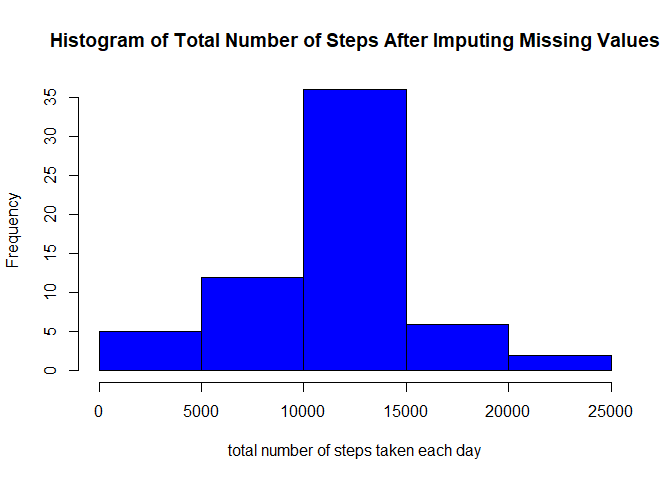
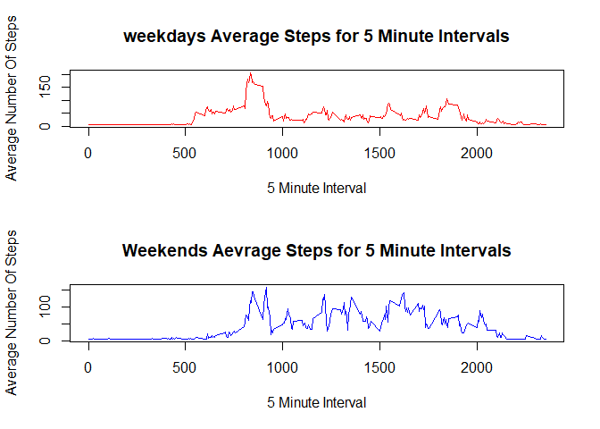

## Loading and preprocessing the data

```r
df <- read.csv("activity/activity.csv")
# Converting the date column to date object.
df$date <- as.Date(df$date, "%Y-%m-%d")
head(df)
```

```
##   steps       date interval
## 1    NA 2012-10-01        0
## 2    NA 2012-10-01        5
## 3    NA 2012-10-01       10
## 4    NA 2012-10-01       15
## 5    NA 2012-10-01       20
## 6    NA 2012-10-01       25
```

## What is mean total number of steps taken per day?

```r
# Grouping steps by date
total.steps <- tapply(df$steps, df$date, FUN=sum, na.rm=TRUE)
tal.steps <- tapply(df$steps, df$date, FUN=sum, na.rm=TRUE)
hist(total.steps, xlab="total number of steps taken each day", col="red", main = "Histogram of Total Number of Steps")
```

<!-- -->

## Mean and Median of steps taken each day

```r
print(paste("The Mean Number Of Daily Steps is ", mean(total.steps, na.rm=TRUE)))
```

```
## [1] "The Mean Number Of Daily Steps is  9354.22950819672"
```

```r
print(paste("The Median Number Of Daily Steps is ",median(total.steps, na.rm=TRUE)))
```

```
## [1] "The Median Number Of Daily Steps is  10395"
```

## What is the average daily activity pattern?

```r
dailyPattern <- tapply(df$steps, df$interval, FUN = mean, na.rm=TRUE)
plot(unique(df$interval),dailyPattern, type="l", col="red", xlab = "5 Minutes Time Interval", ylab = "Average Number of Steps", main = "Average Number of steps taken across all days")
```

<!-- -->

## The 5-minute interval that, on average, contains the maximum number of steps

```r
print(paste("5 Minute Interval containing most steps is ", names(which.max(dailyPattern))))
```

```
## [1] "5 Minute Interval containing most steps is  835"
```

```r
print(paste("The average number of steps for that 5 Minute Interval is ", max(dailyPattern)))
```

```
## [1] "The average number of steps for that 5 Minute Interval is  206.169811320755"
```

## Imputing missing values

### Checking for Missing Values

```r
print(sum(is.na(df$steps)))
```

```
## [1] 2304
```

```r
print(sum(is.na(df$date)))
```

```
## [1] 0
```

```r
print(sum(is.na(df$interval)))
```

```
## [1] 0
```

### Filling Missing Values by mean

```r
df$steps[is.na(df$steps)] <- mean(df$steps, na.rm=TRUE)
head(df)
```

```
##     steps       date interval
## 1 37.3826 2012-10-01        0
## 2 37.3826 2012-10-01        5
## 3 37.3826 2012-10-01       10
## 4 37.3826 2012-10-01       15
## 5 37.3826 2012-10-01       20
## 6 37.3826 2012-10-01       25
```

## Histogram of the total number of steps taken each day after missing values are imputed

```r
total.steps <- tapply(df$steps, df$date, FUN=sum)
hist(total.steps, xlab="total number of steps taken each day", col="blue", main = "Histogram of Total Number of Steps After Imputing Missing Values")
```

<!-- -->

## Mean and Median of steps taken each day after filling missing valies

```r
print(paste("The Mean Number Of Daily Steps after imputing missing values is ", mean(total.steps, na.rm=TRUE)))
```

```
## [1] "The Mean Number Of Daily Steps after imputing missing values is  10766.1886792453"
```

```r
print(paste("The Median Number Of Daily Steps after imputing missing values is ",median(total.steps, na.rm=TRUE)))
```

```
## [1] "The Median Number Of Daily Steps after imputing missing values is  10766.1886792453"
```

## Are there differences in activity patterns between weekdays and weekends?

### Converting the date into weekdays and weekend factors

```r
weekdays1 <- c('Monday', 'Tuesday', 'Wednesday', 'Thursday', 'Friday')
df$daysfactor <- factor((weekdays(df$date) %in% weekdays1), levels=c(FALSE, TRUE), labels=c('weekend', 'weekday')) 
head(df)
```

```
##     steps       date interval daysfactor
## 1 37.3826 2012-10-01        0    weekday
## 2 37.3826 2012-10-01        5    weekday
## 3 37.3826 2012-10-01       10    weekday
## 4 37.3826 2012-10-01       15    weekday
## 5 37.3826 2012-10-01       20    weekday
## 6 37.3826 2012-10-01       25    weekday
```

### Subsetting the dataframe into weekdays and weekends and computing mean

```r
weekdaysdata = subset(df, daysfactor == "weekday")
weekendsdata = subset(df, daysfactor == "weekend")
weekdaysInterval <- tapply(weekdaysdata$steps, weekdaysdata$interval, FUN = mean)
weekendInterval <- tapply(weekendsdata$steps, weekendsdata$interval, FUN = mean)
```

### Plotting the graph

```r
par(mfrow= c(2,1))
plot(unique(weekdaysdata$interval), weekdaysInterval, type="l", col="red", main="weekdays Average Steps for 5 Minute Intervals", xlab = "5 Minute Interval", ylab = "Average Number Of Steps")
plot(unique(weekendsdata$interval), weekendInterval, type="l", col="blue", main="Weekends Aevrage Steps for 5 Minute Intervals", xlab="5 Minute Interval", ylab="Average Number Of Steps")
```

<!-- -->

